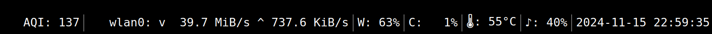

# My Swaybar


This project holding personal implementation of swaybar command for
configuration like:

```
bar {
    output 'My Monitor ID'
    status_command msb
    mode dock
}
```

Example screenshot:


